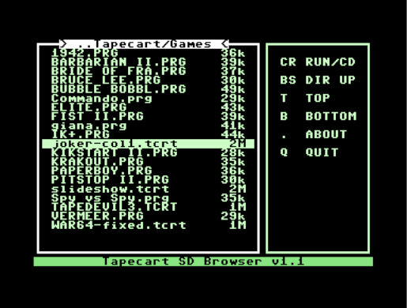
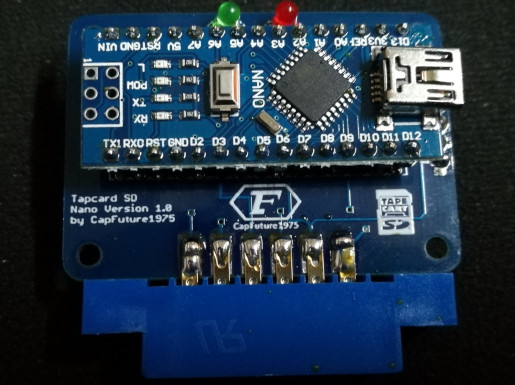

# Tapecart SD #

This is a fork of tapecart that adds SD card support using the Tapuino hardware.
TCRT, PRG, and P00 files can be loaded using the Tapecart SD Browser (browser.prg) which should be placed in the root directory of the SD card.

Tapecart SD is not intended as a replacement for the Tapuino firmware, as there are no support for buttons and display
or using TAP files. Ideally, I would have preferred to use the original tapecart hardware and just replaced the SPI flash
with a SD card reader. However, the program flash in the microcontroller is too small for the FatFs library.

Flash and loader write commands are supported for TCRT files.

## Hardware ##

The Tapecart SD firmware should work on any Tapuino hardware.
For the tapecart LED this can be connected to the PD2 pin which is normally not used on a Tapuino.

There is also also this special version without buttons and display made for the Tapecart SD by CapFuture1975.
The gerber files for that version can be found under [hardware/Tapecart-SD](hardware/Tapecart-SD)

# tapecart #

tapecart - a tape port storage pod for the C64

Copyright (C) 2013-2017 by Ingo Korb <ingo@akana.de>
All rights reserved.
Idea by enthusi

# About #

The tapecart is a low-cost flash storage device for the Commodore 64's
tape port. This repository contains source code and documentation
related to it and will one day contain the schematics and layout files too.

# Structure of the repository #

This repository is organized as follows:

* doc

    This directory contains general documentation regarding the
    tapecart like the protocol it uses to communicate with the C64.

* src-c64

    This directory contains the source code for the C64-side
    software, currently the initial loader and the flashtool.

* sd_browser

    This directory contains the source code for the Tapecart SD Browser.

* src-firmware

    This directory contains the source code for the firmware running
    on the tapecart.

* hardware

    This directory contains schematics and layout for various hardware
    variants of the tapecart.

* mass-programmer

    This directory contains schematics, layout and software for a
    Raspberry Pi addon board that can be used for mass-programming
    tapecarts.

Schematics and layout for the tapecart itself will be released at a
later date.

# License #

The firmware itself is distributed under the following conditions:

    Redistribution and use in source and binary forms, with or without
    modification, are permitted provided that the following conditions
    are met:
    1. Redistributions of source code must retain the above copyright
       notice, this list of conditions and the following disclaimer.
    2. Redistributions in binary form must reproduce the above copyright
       notice, this list of conditions and the following disclaimer in the
       documentation and/or other materials provided with the distribution.

    THIS SOFTWARE IS PROVIDED BY THE REGENTS AND CONTRIBUTORS ``AS IS'' AND
    ANY EXPRESS OR IMPLIED WARRANTIES, INCLUDING, BUT NOT LIMITED TO, THE
    IMPLIED WARRANTIES OF MERCHANTABILITY AND FITNESS FOR A PARTICULAR PURPOSE
    ARE DISCLAIMED.  IN NO EVENT SHALL THE REGENTS OR CONTRIBUTORS BE LIABLE
    FOR ANY DIRECT, INDIRECT, INCIDENTAL, SPECIAL, EXEMPLARY, OR CONSEQUENTIAL
    DAMAGES (INCLUDING, BUT NOT LIMITED TO, PROCUREMENT OF SUBSTITUTE GOODS
    OR SERVICES; LOSS OF USE, DATA, OR PROFITS; OR BUSINESS INTERRUPTION)
    HOWEVER CAUSED AND ON ANY THEORY OF LIABILITY, WHETHER IN CONTRACT, STRICT
    LIABILITY, OR TORT (INCLUDING NEGLIGENCE OR OTHERWISE) ARISING IN ANY WAY
    OUT OF THE USE OF THIS SOFTWARE, EVEN IF ADVISED OF THE POSSIBILITY OF
    SUCH DAMAGE.

Please note that the firmware source code includes third-party header files
taken from the Atmel Software Framework. Please check its
[README](src-firmware/README.md) for more details.
